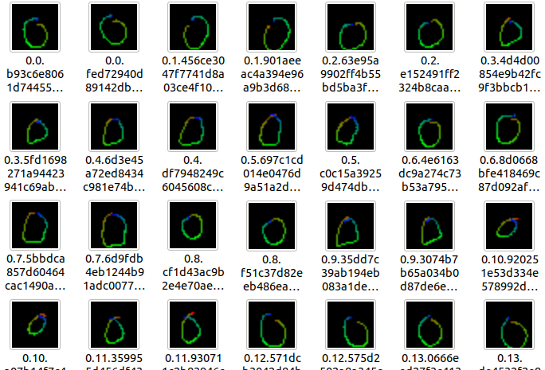

# Edge Impulse Example: stand-alone inferencing (Arducam Pico4ML)

This builds an exported impulse to a .uf2 file that can be dragged and dropped to Arducam Pico4ML.
## Test use

Connect the *Arducam Pico4ML* to the *PC* using the *micro-USB* cable and make sure to force it to *USB Mass Storage Mode* by pressing and holding the **BOOTSEL** button.
A window named *RPI-RP2* will appear on the PC, just drag the [bin/magic_wand.uf2](bin/magic_wand.uf2) file to the *RPI-RP2* window!

## Recompile
### 1. Decompress the files

Unzip the `C++ library` generated by the Edge Impulse project and copy and overwrite it to the current directory

> CMakeLists.txt file without copying

   ```
   .
   ├─ bin
   ├─ CMakeLists.txt
   ├─ edge-impulse-sdk
   ├─ ICM20948
   ├─ LICENSE
   ├─ model-parameters
   ├─ pico_sdk_import.cmake
   ├─ README.md
   ├─ source
   ├─ tflite-model
   └─ tool
   ```

### 2. Compile

1. Create the `build` folder
   ```bash
   mkdir build && cd build
   ```

2. Compile

   ```bash
   camke .. && cmake --build . --parallel
   ```


### 3. Write the `.uf2` file

Connect the *Arducam Pico4ML* to the *PC* using the *micro-USB* cable and make sure to force it to *USB Mass Storage Mode* by pressing and holding the **BOOTSEL** button.
A window named *RPI-RP2* will appear on the PC, just drag the [build/magic_wand.uf2](build/magic_wand.uf2) file to the *RPI-RP2* window!

### Data conversion
1. go to the `tool` folder

2. Install the python dependency library

   ```bash
   pip install -r requirements.txt
   ```

3. Convert the data

   Convert the `json` file downloaded in the previous step to a `png` file

   ```
   python json2png.py --dataset wanddata.json
   ```

   Under the datasets folder you can see the converted `png` file

   
